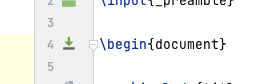

# Opracowanie pytań do egzaminu pisane na kolanie dzień przed

Może komuś pomoże. 

## Wymagania
1. `shell sudo apt-get install texlive-full`
2. [TeXiFy IDEA (plugin)](https://plugins.jetbrains.com/plugin/9473-texify-idea)

## Kompilacja 

Ikonka "pobierania" w pliku `main.tex`. 

## Uwagi
1. Wynikowy PDF znajduje się w folderze `out`.
Folder `out` może być niewidoczny w IntelliJ. 
Aby pokazać uktryte pliki i foldery w IntelliJ:
W panelu drzewka projektu kliknąć `Options` (ikona zębatki) -> `Tree Appearance` -> `Show Excluded Files`.
2. Aby latex "załapał" spis treści trzeba skompilować plik dwa razy.

## Podziękowania
Specjalne podziękowania dla [@m4tx](https://github.com/m4tx) za udostępnienie swoich notatek.
